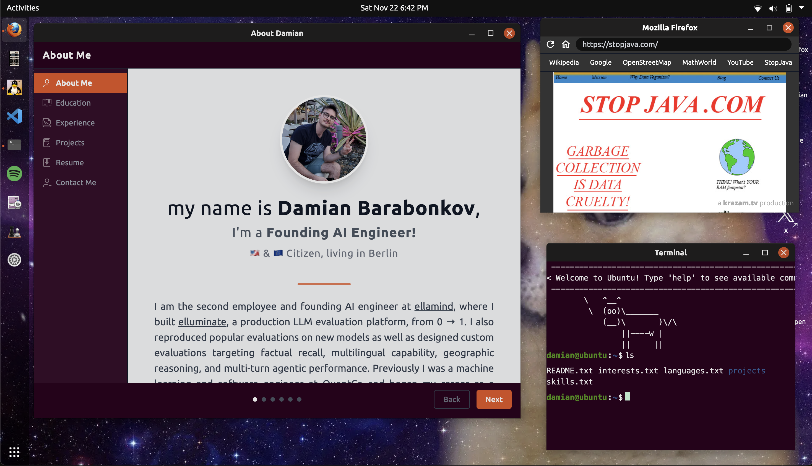

# Web simulation of UbuntuOS

This is a personal portfolio website of theme Ubuntu 20.04, made using Next.js & tailwind CSS.

A live version of the site can be visited at [https://www.damianb.dev/](https://www.damianb.dev/).



## Local development

1. Install dependencies with `pnpm install`.
2. Export a GitHub token so the UI can call the GitHub API:
   ```bash
   export NEXT_PUBLIC_GITHUB_API_TOKEN="ghp_yourtoken"
   ```
3. Run `pnpm dev` while coding

The content specific to me is located in the `./content` directory.

## Deployment

The site deploys automatically via GitHub Actions (see `.github/workflows/gh-deploy.yml`). It triggers daily at 3 AM UTC or on manual dispatch. The workflow updates `content/projects.json` from the GitHub API, builds the Next.js app with pnpm, and deploys to GitHub Pages on the `gh-pages` branch.
